# Analytics of ML Features Usage in IDEs

```python
import pandas as pd
import matplotlib.pyplot as plt
import seaborn as sns
```

## Data loading

```python
data = pd.read_csv('da_internship_task_dataset.csv')
data.head()
```

<div>
<table border="1" class="dataframe">
  <thead>
    <tr style="text-align: right;">
      <th></th>
      <th>uuid</th>
      <th>day_id</th>
      <th>license</th>
      <th>model</th>
      <th>feature</th>
      <th>requests_cnt</th>
      <th>spent_amount</th>
    </tr>
  </thead>
  <tbody>
    <tr>
      <th>0</th>
      <td>user_920</td>
      <td>2025-05-01</td>
      <td>Premium</td>
      <td>Model_A</td>
      <td>Feature_1</td>
      <td>44.0</td>
      <td>16.38</td>
    </tr>
    <tr>
      <th>1</th>
      <td>user_717</td>
      <td>2025-03-04</td>
      <td>Premium</td>
      <td>Model_B</td>
      <td>Feature_2</td>
      <td>72.0</td>
      <td>27.92</td>
    </tr>
    <tr>
      <th>2</th>
      <td>user_610</td>
      <td>2025-05-08</td>
      <td>Premium</td>
      <td>Model_A</td>
      <td>Feature_2</td>
      <td>27.0</td>
      <td>9.87</td>
    </tr>
    <tr>
      <th>3</th>
      <td>user_94</td>
      <td>2025-03-11</td>
      <td>Basic</td>
      <td>Model_D</td>
      <td>Feature_1</td>
      <td>76.0</td>
      <td>14.67</td>
    </tr>
    <tr>
      <th>4</th>
      <td>user_920</td>
      <td>2025-05-14</td>
      <td>Premium</td>
      <td>Model_E</td>
      <td>Feature_3</td>
      <td>47.0</td>
      <td>9.88</td>
    </tr>
  </tbody>
</table>
</div>

## Exploratory data analysis

```python
print(data.describe())
print(data.info())
```

            requests_cnt   spent_amount
    count  122746.000000  122746.000000
    mean       51.260742      12.227798
    std       167.977380      37.588494
    min         1.000000       0.270000
    25%        18.000000       5.140000
    50%        32.000000       8.020000
    75%        54.000000      13.060000
    max     12900.000000    2599.000000
    <class 'pandas.core.frame.DataFrame'>
    RangeIndex: 122746 entries, 0 to 122745
    Data columns (total 7 columns):
     #   Column        Non-Null Count   Dtype
    ---  ------        --------------   -----
     0   uuid          122746 non-null  object
     1   day_id        122746 non-null  object
     2   license       122746 non-null  object
     3   model         122746 non-null  object
     4   feature       122746 non-null  object
     5   requests_cnt  122746 non-null  float64
     6   spent_amount  122746 non-null  float64
    dtypes: float64(2), object(5)
    memory usage: 6.6+ MB
    None

The dataset has 122746 rows and 7 columns. Data are complete, there is no null values. For both columns _requests_cnt_ and _spent_amount_ max values are extremely high (outliers) comparing to median and mean, so standard deviation is also high.

The data shows information about activity of 1866 users. Data was collected over 3 months period.

```python
data['uuid'].drop_duplicates().count()
```

    np.int64(1866)

We plot distributions of columns _requests_cnt_ and _spent_amount_. Due to they have some extremely high values we plot histograms for instances which has values < 99th percentile (for full range we can't see anything on plot).

Also for further analysis we will plot dependencies only for instances with values < 99th percentile, so we create dataframe for these instances.

```python
p99_requests = data['requests_cnt'].quantile(0.99)
p99_spent = data['spent_amount'].quantile(0.99)

# dataframe without outliers
data_p99 = data[(data['requests_cnt'] < p99_requests) & (data['spent_amount'] < p99_spent)]


fig, axes = plt.subplots(1, 2, figsize=(12, 5))

axes[0].hist(data_p99['requests_cnt'], bins=50)
axes[0].set_title("Requests Count (<99th percentile)")

axes[1].hist(data_p99['spent_amount'], bins=50)
axes[1].set_title("Spent Amount (<99th percentile)")

plt.show()
```

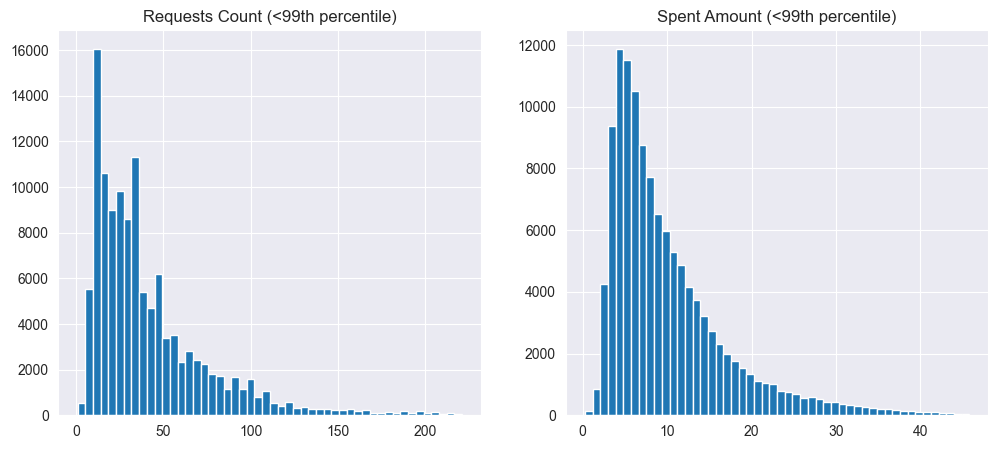

For both columns distribution is skewed and has the same shape. It suggests that most of the users use LLM tools moderately, rather less than more. Plots explain relatively low values of medians and high standard deviation. We expect that between these two columns correlation is very high.

```python
corr = data[['requests_cnt', 'spent_amount']].corr()
print(corr)

data.plot.scatter(x='requests_cnt', y='spent_amount')
```

                  requests_cnt  spent_amount
    requests_cnt      1.000000      0.944177
    spent_amount      0.944177      1.000000

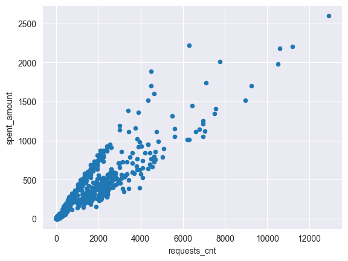

The correlation between _requests_cnt_ and _spent_amount_ is close to one. It means that users, who send more requests spend also more credits.

Now we take a look to columns _license_, _model_, and _feature_.

### License analysis

```python
data['license'].value_counts()
```

    license
    Basic         39233
    Standard      37368
    Enterprise    23516
    Premium       22629
    Name: count, dtype: int64

```python
data.groupby('license')[['requests_cnt', 'spent_amount']].median()
```

<div>
<table border="1" class="dataframe">
  <thead>
    <tr style="text-align: right;">
      <th></th>
      <th>requests_cnt</th>
      <th>spent_amount</th>
    </tr>
    <tr>
      <th>license</th>
      <th></th>
      <th></th>
    </tr>
  </thead>
  <tbody>
    <tr>
      <th>Basic</th>
      <td>20.0</td>
      <td>4.93</td>
    </tr>
    <tr>
      <th>Enterprise</th>
      <td>63.0</td>
      <td>15.27</td>
    </tr>
    <tr>
      <th>Premium</th>
      <td>49.0</td>
      <td>11.87</td>
    </tr>
    <tr>
      <th>Standard</th>
      <td>28.0</td>
      <td>6.86</td>
    </tr>
  </tbody>
</table>
</div>

```python
data.groupby('license')[['requests_cnt', 'spent_amount']].std()
```

<div>
<table border="1" class="dataframe">
  <thead>
    <tr style="text-align: right;">
      <th></th>
      <th>requests_cnt</th>
      <th>spent_amount</th>
    </tr>
    <tr>
      <th>license</th>
      <th></th>
      <th></th>
    </tr>
  </thead>
  <tbody>
    <tr>
      <th>Basic</th>
      <td>72.676932</td>
      <td>15.066691</td>
    </tr>
    <tr>
      <th>Enterprise</th>
      <td>126.284404</td>
      <td>43.376149</td>
    </tr>
    <tr>
      <th>Premium</th>
      <td>287.571104</td>
      <td>60.108829</td>
    </tr>
    <tr>
      <th>Standard</th>
      <td>159.332995</td>
      <td>30.539533</td>
    </tr>
  </tbody>
</table>
</div>

```python
sns.boxplot(data=data_p99, x='license', y='requests_cnt')
```

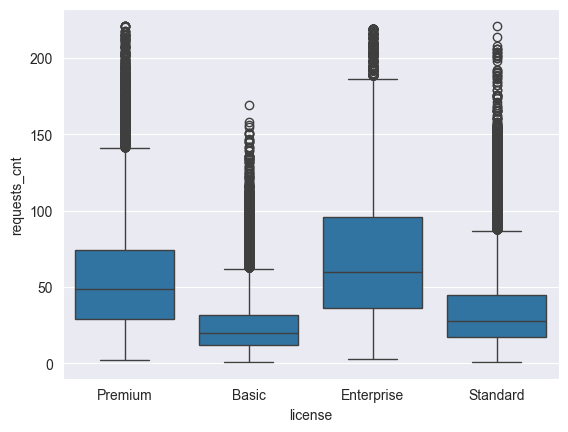

```python
fig, axes = plt.subplots(2, 2, figsize=(12, 8))

axes[0,0].hist(data_p99[data_p99['license']=='Basic']['requests_cnt'], bins=50)
axes[0,0].set_title("Requests Count for Basic license (<99th percentile)")

axes[0,1].hist(data_p99[data_p99['license']=='Standard']['requests_cnt'], bins=50)
axes[0,1].set_title("Requests Count for Standard license (<99th percentile)")

axes[1,0].hist(data_p99[data_p99['license']=='Premium']['requests_cnt'], bins=50)
axes[1,0].set_title("Requests Count for Premium license (<99th percentile)")

axes[1,1].hist(data_p99[data_p99['license']=='Enterprise']['requests_cnt'], bins=50)
axes[1,1].set_title("Requests Count for Enterprise license (<99th percentile)")

plt.show()
```


There are 4 types of _license_. _Basic_ and _Standard_ are the most popular types, however users with license _Premium_ or _Enterprise_ use definitely more LLM tools. It suggests that users, who are professionals or developers and who code a lot using LLM, prefer _Premium_ or _Enterprise_ license. The majority of users are 'common', they don't need to use so much LLM, so for them _Basic_ and _Standard_ license are completely enough. Boxplot shows clearly two groups: _Basic_+_Standard_ and _Premium_+_Enterprise_

We also see that for each license type standard deviation is very high comparing to median values and there is still a lot of outliers even after filtering some of them, so we shouldn't generalize these results. Additionally, we plotted distributions for each type, which also show differences between these two groups.

### Models analysis

```python
data['model'].value_counts()
```

    model
    Model_A    38042
    Model_C    24433
    Model_D    24423
    Model_B    23110
    Model_E    12738
    Name: count, dtype: int64

```python
data.groupby('model')[['requests_cnt', 'spent_amount']].median()
```

<div>
<table border="1" class="dataframe">
  <thead>
    <tr style="text-align: right;">
      <th></th>
      <th>requests_cnt</th>
      <th>spent_amount</th>
    </tr>
    <tr>
      <th>model</th>
      <th></th>
      <th></th>
    </tr>
  </thead>
  <tbody>
    <tr>
      <th>Model_A</th>
      <td>17.0</td>
      <td>6.360</td>
    </tr>
    <tr>
      <th>Model_B</th>
      <td>21.0</td>
      <td>7.600</td>
    </tr>
    <tr>
      <th>Model_C</th>
      <td>48.0</td>
      <td>8.990</td>
    </tr>
    <tr>
      <th>Model_D</th>
      <td>50.0</td>
      <td>9.930</td>
    </tr>
    <tr>
      <th>Model_E</th>
      <td>45.0</td>
      <td>8.485</td>
    </tr>
  </tbody>
</table>
</div>

```python
data.groupby('model')[['requests_cnt', 'spent_amount']].std()
```

<div>
<table border="1" class="dataframe">
  <thead>
    <tr style="text-align: right;">
      <th></th>
      <th>requests_cnt</th>
      <th>spent_amount</th>
    </tr>
    <tr>
      <th>model</th>
      <th></th>
      <th></th>
    </tr>
  </thead>
  <tbody>
    <tr>
      <th>Model_A</th>
      <td>69.990911</td>
      <td>25.809304</td>
    </tr>
    <tr>
      <th>Model_B</th>
      <td>115.046935</td>
      <td>42.330514</td>
    </tr>
    <tr>
      <th>Model_C</th>
      <td>282.339202</td>
      <td>54.463744</td>
    </tr>
    <tr>
      <th>Model_D</th>
      <td>192.551137</td>
      <td>36.012331</td>
    </tr>
    <tr>
      <th>Model_E</th>
      <td>61.527711</td>
      <td>12.175694</td>
    </tr>
  </tbody>
</table>
</div>

```python
sns.boxplot(data=data_p99, x='model', y='requests_cnt')
```

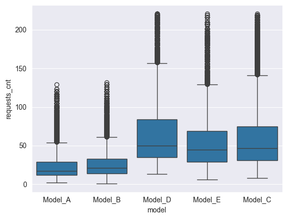

```python
fig, axes = plt.subplots(2, 3, figsize=(14, 8))

axes[0,0].hist(data_p99[data_p99['model']=='Model_A']['requests_cnt'], bins=50)
axes[0,0].set_title("Requests Count for Model_A (<99th percentile)")

axes[0,1].hist(data_p99[data_p99['model']=='Model_B']['requests_cnt'], bins=50)
axes[0,1].set_title("Requests Count for Model_B (<99th percentile)")

axes[0,2].hist(data_p99[data_p99['model']=='Model_C']['requests_cnt'], bins=50)
axes[0,2].set_title("Requests Count for Model_C (<99th percentile)")

axes[1,0].hist(data_p99[data_p99['model']=='Model_D']['requests_cnt'], bins=50)
axes[1,0].set_title("Requests Count for Model_D (<99th percentile)")

axes[1,1].hist(data_p99[data_p99['model']=='Model_E']['requests_cnt'], bins=50)
axes[1,1].set_title("Requests Count for Model_E (<99th percentile)")

plt.show()
```

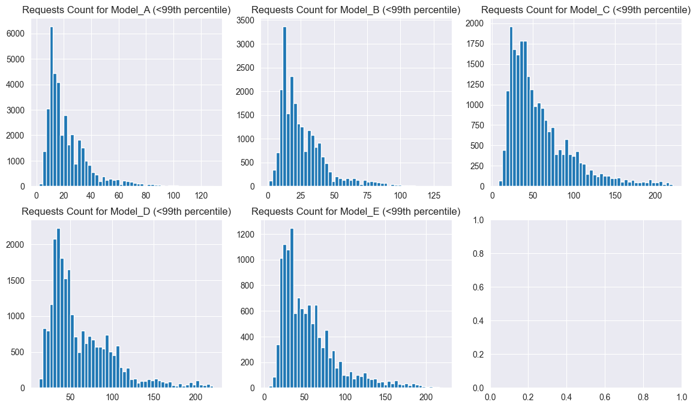

The most popular is _Model_A_, and _Model_E_ is definitely the least popular. There is no significant differences in popularity between models _B_, _C_, and _D_. When we analyse how many requests users send to particular types, we can see that users use more models _C_, _D_, and _E_. Boxplot shows that for _A_ and _B_ we do not have so high values as for other models. On histograms, we see that _A_ and _B_ are used less, while the rest is used more. Probably models _A_ and _B_ are used by users with _Basic_ and _Standard_ license, and _C_, _D_, and _E_ are used by users with _Premium_ or _Enterprise_ license.

### Features analysis

```python
data['feature'].value_counts()
```

    feature
    Feature_1    45399
    Feature_2    36449
    Feature_3    26283
    Feature_5     7372
    Feature_4     7243
    Name: count, dtype: int64

```python
data.groupby('feature')[['requests_cnt', 'spent_amount']].median()
```

<div>
<table border="1" class="dataframe">
  <thead>
    <tr style="text-align: right;">
      <th></th>
      <th>requests_cnt</th>
      <th>spent_amount</th>
    </tr>
    <tr>
      <th>feature</th>
      <th></th>
      <th></th>
    </tr>
  </thead>
  <tbody>
    <tr>
      <th>Feature_1</th>
      <td>35.0</td>
      <td>8.76</td>
    </tr>
    <tr>
      <th>Feature_2</th>
      <td>31.0</td>
      <td>7.82</td>
    </tr>
    <tr>
      <th>Feature_3</th>
      <td>29.0</td>
      <td>7.46</td>
    </tr>
    <tr>
      <th>Feature_4</th>
      <td>37.0</td>
      <td>8.26</td>
    </tr>
    <tr>
      <th>Feature_5</th>
      <td>26.0</td>
      <td>6.60</td>
    </tr>
  </tbody>
</table>
</div>

```python
data.groupby('feature')[['requests_cnt', 'spent_amount']].std()
```

<div>
<table border="1" class="dataframe">
  <thead>
    <tr style="text-align: right;">
      <th></th>
      <th>requests_cnt</th>
      <th>spent_amount</th>
    </tr>
    <tr>
      <th>feature</th>
      <th></th>
      <th></th>
    </tr>
  </thead>
  <tbody>
    <tr>
      <th>Feature_1</th>
      <td>194.314809</td>
      <td>40.040272</td>
    </tr>
    <tr>
      <th>Feature_2</th>
      <td>153.524718</td>
      <td>38.830995</td>
    </tr>
    <tr>
      <th>Feature_3</th>
      <td>129.585523</td>
      <td>32.302560</td>
    </tr>
    <tr>
      <th>Feature_4</th>
      <td>210.805842</td>
      <td>43.369655</td>
    </tr>
    <tr>
      <th>Feature_5</th>
      <td>128.276726</td>
      <td>24.636325</td>
    </tr>
  </tbody>
</table>
</div>

```python
sns.boxplot(data=data_p99, x='feature', y='requests_cnt')
```


```python
fig, axes = plt.subplots(2, 3, figsize=(14, 8))

axes[0,0].hist(data_p99[data_p99['feature']=='Feature_1']['requests_cnt'], bins=50)
axes[0,0].set_title("Requests Count for Feature_1 (<99th percentile)")

axes[0,1].hist(data_p99[data_p99['feature']=='Feature_2']['requests_cnt'], bins=50)
axes[0,1].set_title("Requests Count for Feature_2 (<99th percentile)")

axes[0,2].hist(data_p99[data_p99['feature']=='Feature_3']['requests_cnt'], bins=50)
axes[0,2].set_title("Requests Count for Feature_3 (<99th percentile)")

axes[1,0].hist(data_p99[data_p99['feature']=='Feature_4']['requests_cnt'], bins=50)
axes[1,0].set_title("Requests Count for Feature_4 (<99th percentile)")

axes[1,1].hist(data_p99[data_p99['feature']=='Feature_5']['requests_cnt'], bins=50)
axes[1,1].set_title("Requests Count for Feature_5 (<99th percentile)")

plt.show()
```

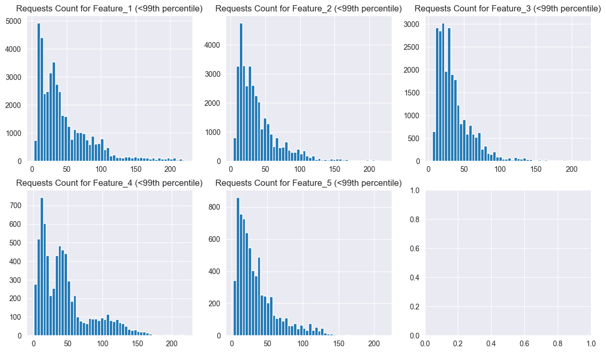

The most popular features are Feature_1, Feature_2, and Feature_3. Feature_4 and Feature_5 are far less popular. There is no very big differences between medians of requests for each model, but we observe the highest median for _Feature_4_, and the lower for _Feature_5_. Also for this column standard deviation is extremely high. Boxplot visualize small differences in values of medians. On histograms, we only see the differences in requests count.

### Features vs. Models and Licenses

```python
cross_model_feature = pd.crosstab(data['model'], data['feature'])
sns.heatmap(cross_model_feature, annot=True, fmt='d', cmap='coolwarm')
```

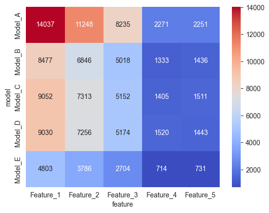

```python
cross_license_feature = pd.crosstab(data['license'], data['feature'])
sns.heatmap(cross_license_feature, annot=True, fmt='d', cmap='coolwarm')
```

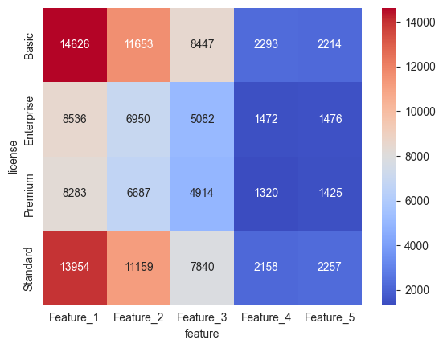

These heatmaps show what we have already observed. Because features _1_ and _2_, licenses _Basic_ and _Standard_, and _Model_A_ are the most popular, they dominate heatmaps. It is rather just statistics than any connections between using certain features with certain models or licenses.

### Analysis of trends over time

Firstly, we convert _day_id_ to datetime format.

```python
data['day_id'] = pd.to_datetime(data['day_id'])
data.head()
```

<div>
<table border="1" class="dataframe">
  <thead>
    <tr style="text-align: right;">
      <th></th>
      <th>uuid</th>
      <th>day_id</th>
      <th>license</th>
      <th>model</th>
      <th>feature</th>
      <th>requests_cnt</th>
      <th>spent_amount</th>
    </tr>
  </thead>
  <tbody>
    <tr>
      <th>0</th>
      <td>user_920</td>
      <td>2025-05-01</td>
      <td>Premium</td>
      <td>Model_A</td>
      <td>Feature_1</td>
      <td>44.0</td>
      <td>16.38</td>
    </tr>
    <tr>
      <th>1</th>
      <td>user_717</td>
      <td>2025-03-04</td>
      <td>Premium</td>
      <td>Model_B</td>
      <td>Feature_2</td>
      <td>72.0</td>
      <td>27.92</td>
    </tr>
    <tr>
      <th>2</th>
      <td>user_610</td>
      <td>2025-05-08</td>
      <td>Premium</td>
      <td>Model_A</td>
      <td>Feature_2</td>
      <td>27.0</td>
      <td>9.87</td>
    </tr>
    <tr>
      <th>3</th>
      <td>user_94</td>
      <td>2025-03-11</td>
      <td>Basic</td>
      <td>Model_D</td>
      <td>Feature_1</td>
      <td>76.0</td>
      <td>14.67</td>
    </tr>
    <tr>
      <th>4</th>
      <td>user_920</td>
      <td>2025-05-14</td>
      <td>Premium</td>
      <td>Model_E</td>
      <td>Feature_3</td>
      <td>47.0</td>
      <td>9.88</td>
    </tr>
  </tbody>
</table>
</div>

```python
daily = data.groupby('day_id')[['requests_cnt', 'spent_amount']].sum()
daily.plot(figsize=(12,4))
```

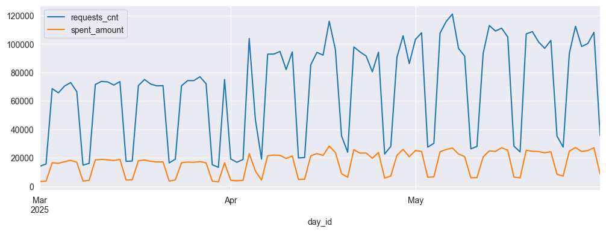

The daily perspective shows some trends. For first month activity was definitely lower than for next two months. Moreover, we can see regular breakdowns - probably it is related to weekends, they seem to occur every 7 days. It could be due to professional developers, who use LLM tools at most do not work during weekends. There is one additional breakdown in April. Maybe it is due to some event such as Easter.

```python
weekly = data.set_index('day_id').resample('W')[['requests_cnt','spent_amount']].sum()
weekly.plot(figsize=(12,4))
```

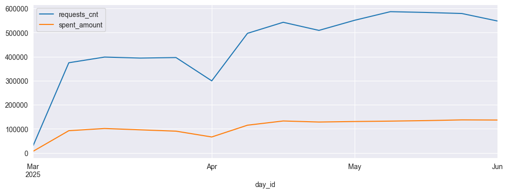

The weekly perspective shows again that first month wasn't so good as next two. The breakdown in April is visible here. We can't notice any trends.

```python
monthly = data.set_index('day_id').resample('ME')[['requests_cnt','spent_amount']].sum()
monthly.plot(figsize=(12,4))
```

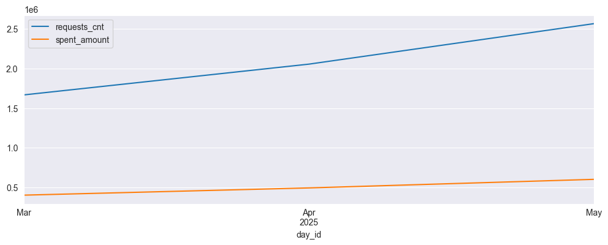

In monthly perspective we see that users' activity increase linearly over time. It is good perspective for further development of LLM tools.

## Summary

Both requests_cnt and spent_amount are right-skewed, meaning most users use the tools moderately. The correlation between them is very high, so users who send more requests also spend more.

Basic and Standard licenses are most common, while Premium and Enterprise users show much higher activity. However, the variance is large, so differences should be interpreted cautiously.

Model_A is the most used, while Models C, D, and E tend to have higher request counts, likely linked to advanced license types. Feature_1–3 are most popular; Feature_4–5 are used less.

Time-based trends show increasing activity over the months, with regular drops probably on weekends and one drop in April. Overall usage is growing over time.
